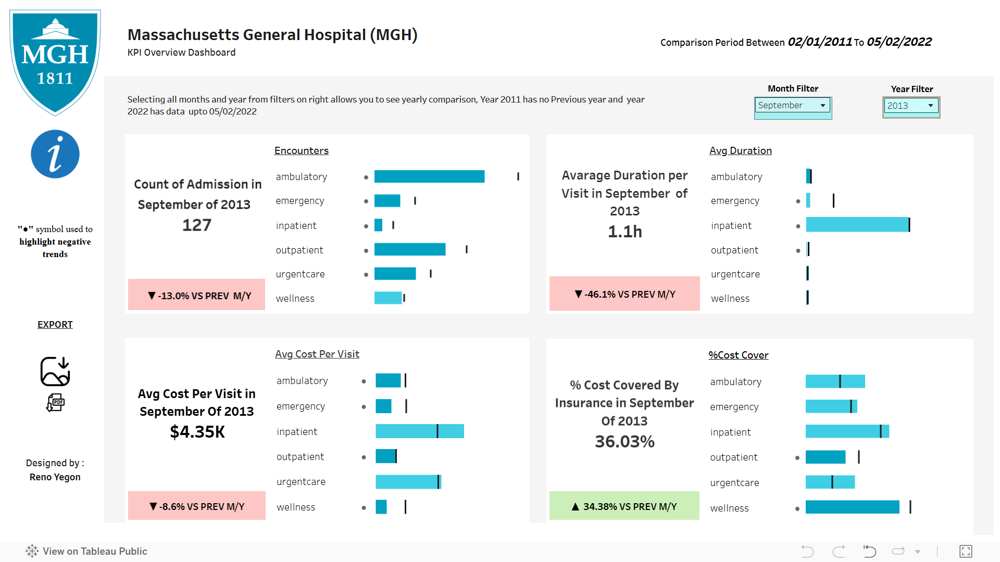

### Project Background
The Massachusetts General Hospital (MGH) executive team requested a high-level KPI report to assess the hospital's performance across key areas such as admissions, readmissions, length of stay, costs, and insurance coverage. The report is based on  patient data from 2011 to 2022, encompassing nearly 1,000 patients and 27,891 encounters. The goal is to provide actionable insights to improve operational efficiency, patient outcomes, and financial performance.
#### Dataset:
The dataset consists of  records of nearly 1,000 MGH patients, capturing patient demographics, insurance coverage, medical encounters, and procedures. Each encounter record includes details such as start and end date, total cost, encounter type, and insurance coverage
#### Data Preparation & Exploration
##### Goal: Prepare the data for an effective data model for analysis.  
To facilitate accurate analysis, the following steps were performed:
##### Key steps taken:

##### In Power Query:
Built dimension tables, including encounter class, age, age group, and date.
Merged encounter and patient tables to get the age at encounter and the date differences between death and each encounter.
Extracted the hour of each encounter visit.
Grouped procedure table to get procedure line cost totals for each encounter, then merged this into the encounter table.
##### In Tableau:
Calculated LOS by minutes for non-admission encounters, and by days for admission encounters.
Built an admission type calculated column to identify initial admissions and readmissions.
Built all parameter tables for dynamic analysis
  #### Key Definitions & Considerations Admissions & Readmissions:
- Admission: A patient formally accepted into the hospital for an overnight stay.
- Readmission: A return to the hospital within 30 days of discharge, often indicating care quality issues.
##### I decided to make the first page very simple, featuring just five KPI’s:

- The count of admissions    
- The average duration per visit    
- The average cost per visit    
- The percentage of costs covered by insurances

This approach allows executives to receive the most relevant information in just a few seconds.

I chose to only focus on encounters because they include all information, from simple check-ups to complex operations, providing an unfiltered overview of the hospital.

The only interaction on this page is the month and year filter, enabling executives to view monthly, yearly, and year-to-date performance if the year is incomplete. The chart titles and texts change accordingly.

##### Four of the Five KPI’s follow this structure:

The value for the selected time period (e.g., average cost per visit)  
To provide context: The comparison value for the previous time period (e.g., average cost per visit last month)   
To visualize the difference: The delta between these two values   
A bar chart showing the value for the selected time period (first bullet point) broken down by encounter class vs. previous time period (e.g., average cost per visit per encounter class vs. average cost per visit per encounter class last month)   
### Executive Summary

This report analyzes MGH's performance from 2011 to 2022, and answers the following questions:  
1.How many patients have been admitted or readmitted over time?   
2.How long are patients staying in the hospital, on average?  
3.How much is the average cost per visit?   
4.How many procedures are covered by insurance?   

## 📊 My Tableau Dashboard

Check out my interactive Tableau dashboard here:  
[🔗 View Dashboard](https://public.tableau.com/views/MassachusettsGeneralHospitalMGH/Dashboard1?:language=en-US&:sid=&:redirect=auth&:display_count=n&:origin=viz_share_link)

### Insights Deep-Dive

#### 1. Patient Admissions & Readmissions
Total Admissions: 1135   
Total Readmissions: 290
Unique Admission: 153 peaking in 2014 and 2020  
The readmission was 4.07 % within 30 days    
The hospital maintaining improved operational practices is a way of capitalizing on readmission post-pandemic  
#####	Trends:  
-	Significant decline in admissions and readmissions in 2022, potentially due to external factors like policy changes or the COVID-19 pandemic.  
#####	Implications:  
-	High readmission rates may indicate issues with discharge planning, post-discharge care, or patient follow-up.
-	Focus on improving care transitions and patient education to reduce readmissions.
#### 2. Length of Stay (LOS)
-	Overall Average LOS: 7.3 hours
-	There was a peak in average length of stay in 2020 to 61.4hours
-	By Encounter Type:
-	Inpatient: 36.84 hours (longest)
-	Urgent Care: 0.25 hours (shortest)
-	Outpatient: 5.8hours
-	Emergency:1.5hours
-	Wellness: 0.25hours
--	Outlier: 2014 had the highest average LOS at 38.07 hours, warranting further investigation.
#####	Implications:
-	Longer LOS may indicate inefficiencies in care delivery or complex cases.
-	Optimize workflows and resource allocation to reduce LOS, particularly for inpatient care.
#### 3. Cost Analysis
-	Average Cost per Visit: $3.6K
- Admission average cost per visit was $7.7K doubling non-admission with $3.5K, 2020 had $14K
- Admission cost surged 4.8K during 2020 with those non-insured admission average cost at 9.1K,middle age adults topping with 12.98K
- Elderly are most insured with average cost 10.2K
-	Total Patient Costs (2011-2022): $101.5K
#####	Implications:
-	High inpatient costs may strain hospital resources.
-	Explore cost-saving measures, such as reducing unnecessary tests or optimizing supply chain management.
#### 4. Insurance Coverage
-	Total Procedures Covered by Insurance: 14.7K with 5.8K uninsured
- 60% of procedures covered by insurance while 40% are uninsured with Medicare covering 33% of the insurance
- Average cost of procedure is 4.3k  ,uninsured patients avaraging 5.6K ,5.0K being 17 to 64 Age Group
- Uninsured admissions averaged 9K while Uninsured non admissions averaged 5K
- Insured admissions averaged 7K while non admission Insured average 3K
#####	Implications:
-	Uninsured patients face significant financial burdens, potentially impacting access to care.
-	Collaborate with insurers to improve coverage and explore financial assistance programs for uninsured patients.
### Answers to Key Questions
1.How many patients have been admitted or readmitted over time? Total Patients: 1135, Readmitted: 290 .   
2.How long are patients staying in the hospital, on average? Average stay: a little over 7 hours, skewed by outliers.   
3.How much is the average cost per visit? Average cost: $3.6K, skewed by outliers.   
4.How many procedures are covered by insurance? 60% of procedure costs are covered by insurance.   
### Recommendations
##### 1.	Reduce Readmissions:
-	Implement robust discharge planning and post-discharge follow-up programs.
-	Focus on high-risk patients to prevent avoidable readmissions.
##### 2.	Optimize Length of Stay:
-	Investigate the outlier in 2014 (38.07 hours) to identify inefficiencies.
-	Streamline workflows and improve care coordination to reduce LOS.
##### 3.	Manage Costs:
-	Focus on reducing inpatient costs through resource optimization and cost-effective care delivery.
-	Explore partnerships with payers to negotiate better reimbursement rates.
##### 4.	Improve Insurance Coverage:
-	Collaborate with insurers like Anthem to expand coverage for uninsured patients.
-	Develop financial assistance programs to support uninsured patients.
#### Key Questions for Stakeholders Prior to Project Advancement
These are some questions I would've loved to ask stakeholders/project leads to learn more about their own needs/existing knowledge on the objective at hand.
-	What interval do you use for measuring readmissions: 30, 60, or 90 days after a previous admission?
-	Should readmissions be related to the same medical conditions or reasons as the initial admission?
-	How are encounter entries recorded? Given that some admissions are logged exactly 24 hours apart, how should these be treated? Are these entries reset daily, or should they be considered continuous admissions?
### Assumptions and Caveats
1.	Timeframe: The analysis covers 2011-2022, and trends may not be applicable to future years.
2.	External Factors: External influences like policy changes or the COVID-19 pandemic may impact the data.
3.	Insurance Coverage: Coverage rates are based on procedure costs and may not reflect overall encounter costs.

